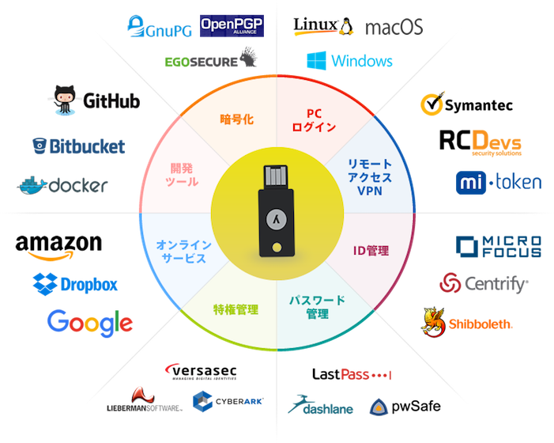
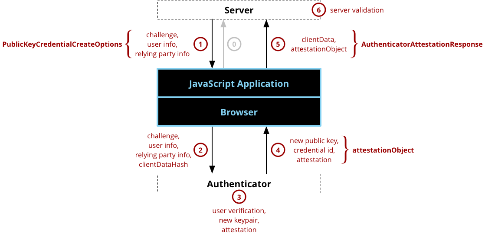
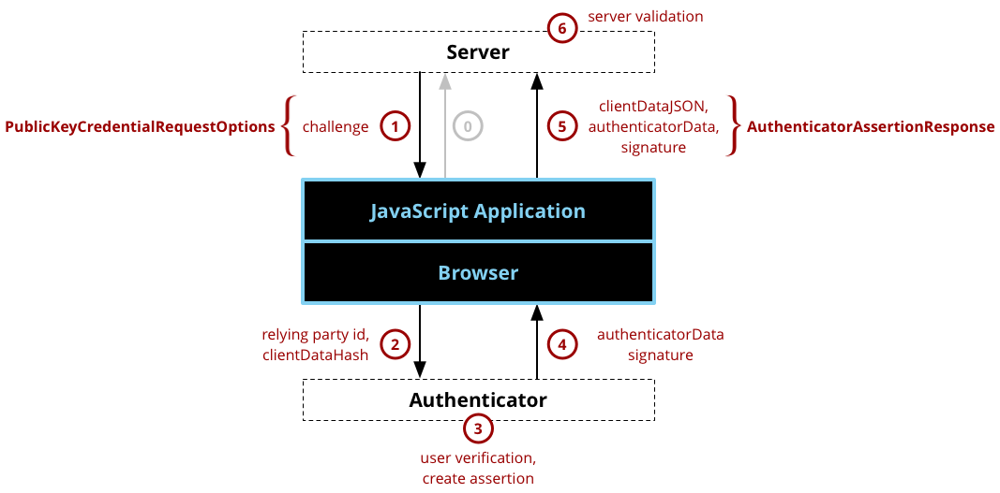

## OWASP Top 10 の大転換?
## パスワード不要認証 WebAuthn

<a href="https://twitter.com/kasecato" target="_blank"></a>

#### OWASP Kyushu Local Chapter Meeting 11th
#### @[さくらインターネット福岡オフィス](https://owasp-kyushu.connpass.com/event/87616/)

2018/5/25 <a href="https://twitter.com/kasecato" target="_blank">@kasecato</a>


## &lt;script&gt;alert('about me')&lt;/script&gt;
```js
const addTimeline2018 = (profile) => {
    profile.timeline.push({
        year: 2018,
        lang: 'Java',
        company: 'Nulab',
        team: 'Nulab Apps',
    })
}
```


## OWASP Top 10 - 2017
- A1:2017 インジェクション
- **A2:2017 認証の不備**
- **A3:2017 機微な情報の露出**
- A4:2017 XML 外部エンティティ参照 (XXE)
- A5:2017 アクセス制御の不備
- **A6:2017 不適切なセキュリティ設定**
- A7:2017 クロスサイトスクリプティング (XSS)
- A8:2017 安全でないデシリアライゼーション
- A9:2017 既知の脆弱性のあるコンポーネントの使用
- A10:2017 不十分なロギングとモニタリング


## A2:2017 認証の不備
> 攻撃者は、アカウントリスト攻撃（パスワードリスト攻撃）に使える数十億にのぼる有効なユーザ名と**パスワード**の組み合わせ、初期設定の管理者アカウントリスト、自動化された総当たり攻撃、辞書攻撃ツールを悪用してきます


## A3:2017 機微な情報の露出
> サーバ上にある平文のデータを盗み出します。一般的には、このリスクでは手動による攻撃を必要とします。あらかじめ盗み出した**パスワード**データベースには、グラフィック処理ユニット(GPU)を使って総当たり攻撃できます。


## A6:2017 不適切なセキュリティ設定
> アプリケーションが管理用のコンソールでデフォルトのアカウントが変更されていないと、攻撃者はデフォルトの**パスワード**を使ってログインし、乗っ取ってしまいます


## OWASP Top10 - 2017 の 3 割は「**パスワード**」に関係する問題と思われる 🤔


## パスワード不要の次世代認証**「Web Authntication API (WebAuthn)」**が W3C で標準化を開始
### 普及すれば OWASP Top 10 に大転換を起こす，かもしれない
<!-- .element: class="fragment" data-fragment-index="10" -->


### なぜ WebAuthn が W3C で標準化されたのか?
- 2009年 PayPal に生体情報で本人確認を行う構想が提案された
<!-- .element: class="fragment" data-fragment-index="10" -->
- 2012年 PayPal 等が「FIDO アライアンス」を設立
<!-- .element: class="fragment" data-fragment-index="20" -->
    - FIDO (Fast IDentity Online: 素早いオンライン認証)
<!-- .element: class="fragment" data-fragment-index="25" -->
- 2014年 FIDO がパスワードレス プロトコルを公開 (FIDO UAF, U2F)
<!-- .element: class="fragment" data-fragment-index="30" -->
- 2016年 Microsoft, Google や PayPal 等が FIDO UAF, U2F を W3C で標準化開始　(FIDO2, WebAuthn)
<!-- .element: class="fragment" data-fragment-index="40" -->
- 2018年 WebAuthn が Firefox 60 と Chrome 67 で有効化 (Edge も)
<!-- .element: class="fragment" data-fragment-index="50" -->
    - 実はもうブラウザにすでに組込まれている
<!-- .element: class="fragment" data-fragment-index="60" -->


### FIDO が使えるサービス (FIDO2 とは限らない)



# WebAuthn (FIDO2) Demo
## https://apps.nulab-inc.com/
## https://webauthn.org/


## WebAuthn (FIDO2) 
### 正式名称は
## Web Authentication: An API for accessing Public Key Credentials Level 1
勝手に訳すと「Web 認証: 公開鍵認証情報アクセス API Level 1」
<!-- .element: class="fragment" data-fragment-index="10" -->


### なぜ WebAuthn はパスワードが不要なのか?
- Yahoo, 「[FIDO認証と公開鍵暗号 - JNSA](http://www.jnsa.org/seminar/pki-day/2017/data/170419_gomi.pdf)」 🙇‍


## 登録 = [navigator.credentials.create](https://w3c.github.io/webappsec-credential-management/#dom-credentialscontainer-create)



## 認証 = [navigator.credentials.get](https://w3c.github.io/webappsec-credential-management/#dom-credentialscontainer-get)



### WebAuthn は難しいので Java Library を作ってみた…
- [社内ハッカソン](https://nulab-inc.com/ja/blog/nulab/nulab-general-meeting-2018-hackathon-1/)
が開催される
<!-- .element: class="fragment" data-fragment-index="10" -->

- ハッカソンのメンバから WebAuthn の存在を教えてもらう
<!-- .element: class="fragment" data-fragment-index="20" -->

- Google の [WebAuthn Demo](https://github.com/google/webauthndemo) を Spring Boot に移植してみる
<!-- .element: class="fragment" data-fragment-index="30" -->

- 移植で気になった点を PR して Google WebAuthn Demo のコミッタに
<!-- .element: class="fragment" data-fragment-index="40" -->

- 社内ハッカソンが開催され 1 日で WebAuthn を製品に組込んだ
<!-- .element: class="fragment" data-fragment-index="50" -->

- 社内ハッカソン用にライブラリを Maven Central に公開したが…
<!-- .element: class="fragment" data-fragment-index="60" -->
    - [Yubiko がもっと良いライブラリを公開したみたい](https://github.com/Yubico/java-webauthn-server)
<!-- .element: class="fragment" data-fragment-index="60" -->


## ありがとうございました 🙇‍


## 参考ノート
1. OWASP, 「[OWASP Top 10 - 2017](https://www.owasp.org/images/2/23/OWASP_Top_10-2017%28ja%29.pdf)」
1. Yubico, 「[Yubicoプロダクト紹介](https://www.yubion.com/yubico/)」
1. FIDO, 「[FIDOアライアンスの沿革](https://fidoalliance.org/fidoアライアンスの沿革/?lang=ja)」
1. W3C, "[Web Authentication: An API for accessing Public Key Credentials Level 1](https://www.w3.org/TR/webauthn/)"
1. Yahoo, 「[FIDO認証と公開鍵暗号 - JNSA](http://www.jnsa.org/seminar/pki-day/2017/data/170419_gomi.pdf)」
1. MDN, "[Web Authentication API](https://developer.mozilla.org/en-US/docs/Web/API/Web_Authentication_API)"
1. GitHub, "[Google WebAuthnDemo](https://github.com/google/webauthndemo)"
1. FIDO, "[Webauthn Tutorial](https://slides.com/fidoalliance/jan-2018-fido-seminar-webauthn-tutorial#/)"
